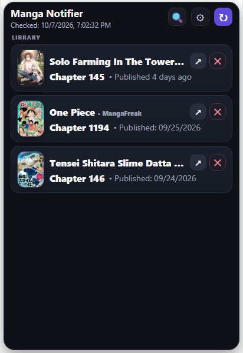

# Manga Notifier

A simple Chrome extension that tracks manga and webtoon updates and notifies you when a new chapter is available. Built with ChatGPT.

  

## Supported websites

- [MangaDex](https://mangadex.org/)
- [MangaFreak](https://ww3.mangafreak.me/)
- [WEBTOON](https://www.webtoons.com/)
- [Mgeko](https://www.mgeko.cc/)
- [SushiScan](https://sushiscan.net/)
- [MangaFire](https://mangafire.to/)

## Features

- Track multiple manga and webtoon series
- Receive notifications for new chapters
- Display manga covers
- Search and sort your library
- Adjustable popup size
- Normal and compact display modes
- Automatic update checks
- TXT and JSON library import/export
- Multi-language interface

## Installation

1. Download the repository.
2. Open `chrome://extensions/`
3. Enable **Developer mode**
4. Click **Load unpacked**
5. Select the extension folder

## Privacy

Manga Notifier stores your library and settings locally in Chrome.

It does not use a dedicated remote server or database.

The extension only connects to supported websites to check for new chapters and retrieve manga information.

## License

This project is licensed under the PolyForm Noncommercial License 1.0.0.

## Request a website

If you want support for another website, open a request here:

[Request website support](https://github.com/Ellimaaac/Manga-Update-Notifier/issues/new)
